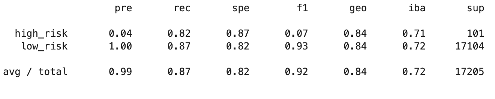

# Credit-Risk-Analysis

## Overview
Using the credit card credit dataset, you’ll oversample the data using the RandomOverSampler and SMOTE algorithms, and undersample the data using the ClusterCentroids algorithm. Then, you’ll use a combinatorial approach of over- and-undersampling using the SMOTEENN algorithm. Next, you’ll compare two new machine learning models that reduce bias, BalancedRandomForestClassifier and EasyEnsembleClassifier, to predict credit risk. 

## Results:
#### Balanced Accuracy Scores

* For our RandomOverSampling method we show a precision score of 0.06.

* In our SMOTE method we showed a precision score of 0.07.

* Using the UnderSampling method we also got a 0.06 F1 score.

* Combining Over and Under sampling we were provided with another F1 score of 0.06.

* In our Balanced Random Forest Classifier we had another precision score of 0.06.

* Using the Easy Ensemble AdaBoost Classifier we had our best F1 score at 0.16.

## Summary
* Looking at our F1 scores the most effective method to use is the Easy Ensemble Classifier. 
